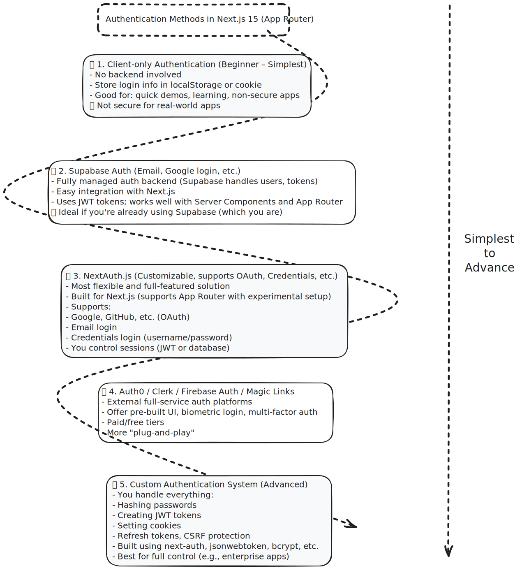
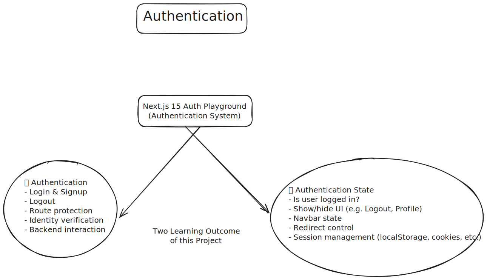

#  Authentication in Next.js 15 - Unified Project Plan

- We are going to define our **base project** once, then use the *same project idea* to implement all auth methods one by one. That way, we'll truly understand the differences and internal workings of authentication.
- There are **5 methods** to implement Authentication (1 being simplest and 5 being the most advanced):
  1. [Client-only Authentication (Beginner - Simplest)](./Documentation/level%201%20client%20side%20only.md), [Live Web App](https://nextjs-level1-auth.vercel.app/)
  2. [Supabase Auth](./Documentation/level%202%20Supabase%20Auth.md), [Live Web App](https://nextjs-level2-auth.vercel.app/)
  3. NextAuth.js
  4. Autho / Clerk / firebase Auth / Magic Links
  5. Custom Authentication System (Advanced)

- We are going to create a simple Next.js 15 project called:  
  
  > ## ` Auth Playground`
  
  This will be used to implement and understand various authentication methods — from basic to advanced — using the **App Router**, **Server Components**, and tools like **Supabase**, **NextAuth.js**, etc.

---

##  Project Goal

Build a minimal web app that has:

- ✅ A Login Page (and Signup Page if needed)  
- 🔒 A Protected Route: `/secret`  
- 🏠 A Home Page: `/` – open to everyone  
- 👤 Authenticated users can:  
  - View the Secret Page  
  - See their name/email in the navbar  
  - Logout  
- 🚫 Unauthenticated users trying to access `/secret` are redirected to `/login`

---

##  Also Learning: Authentication State

In every method, we’ll also learn how to **track and manage authentication state**, i.e., how the app knows whether a user is currently logged in or not.

We'll implement:

- Showing "Login" or "Logout" in the Navbar based on auth state  
- Displaying logged-in user’s name/email/photo (if available)  
- Conditionally rendering pages and routes based on login state  
- Handling logout and UI updates accordingly  

This is called managing the **Auth State** and is a critical part of real-world authentication flows.

---

##  Common UI Pages

We'll reuse the same page structure in every auth method:

| Route     | Description                         |
| --------- | ----------------------------------- |
| `/`       | Public home page                    |
| `/login`  | Login form                          |
| `/signup` | Signup form (if method supports it) |
| `/secret` | Protected page (requires login)     |

---

## 🛠️ Technologies

We’ll use:

- **Next.js 15 App Router**  
- **Tailwind CSS** (for basic styling)  
- **ShadCN** or simple HTML forms  
- A global **Layout with Navbar** that shows Login/Logout buttons based on Auth State  
- **Client components** (`'use client'`) where needed for interactivity  

---

---

##  Benchmark Checklist for Each Method

Use this exact checklist for **all five** authentication methods. You can keep each level in its own project folder.

### 1. Authentication Functionality

| Feature                        | Required? | Notes                          |
| ------------------------------ | --------- | ------------------------------ |
|  Login                        | Yes       | Dummy/local/real API           |
|  Logout                       | Yes       | Clear session/token/etc.       |
|  Signup *(if supported)*      | Optional  | Only if the method supports it |
|  Session Persistence          | Yes       | localStorage, cookies, JWT     |
|  Route Protection (`/secret`) | Yes       | Redirect if not logged in      |

### 2. Authentication State (Frontend Logic)

| Feature                           | Required? | Notes                                 |
| --------------------------------- | --------- | ------------------------------------- |
|  Detect if user is logged in     | Yes       | On mount via context/provider         |
|  Show login/logout conditionally | Yes       | In Navbar, based on context state     |
|  Display user info (name/email)  | Yes       | From context                          |
|  Redirect after login/logout     | Yes       | e.g., login → `/secret`, logout → `/` |
|  Update UI on login/logout       | Yes       | State managed via context             |

### 3. Pages (Route Checklist)

| Route      | Purpose                        | Must Have?  |
| ---------- | ------------------------------ | ----------- |
| `/`        | Public Home                    |  Yes       |
| `/login`   | Login form                     |  Yes       |
| `/signup`  | Signup form                    |  Optional |
| `/secret`  | Protected page                 |  Yes       |
| `/profile` | Logged-in user info (optional) |  Optional |

### 4. Tech/Method-Specific Setup

| Task                                     | Example                              |
| ---------------------------------------- | ------------------------------------ |
| Set up backend/client SDK if needed      | Supabase, Firebase, etc.             |
| Configure environment variables          | e.g., Supabase URL/Key, NextAuth env |
| Wrap app in provider/context (if needed) | For NextAuth, Clerk, etc.            |
| Middleware setup (for advanced methods)  | JWT cookies, server checks           |

### 5. Test Cases Checklist

| Test Scenario                            |   Should Work             |
| ---------------------------------------- | ------------------------- |
| Login with valid credentials             | Yes                       |
| Login with invalid credentials           | Proper error              |
| Visit `/secret` while logged out         | Redirects                 |
| Visit `/secret` while logged in          | Success                   |
| Refresh after login                      | Still logged in           |
| Logout                                   | Clears session, redirects |
| Navbar updates correctly on login/logout | Yes                       |
